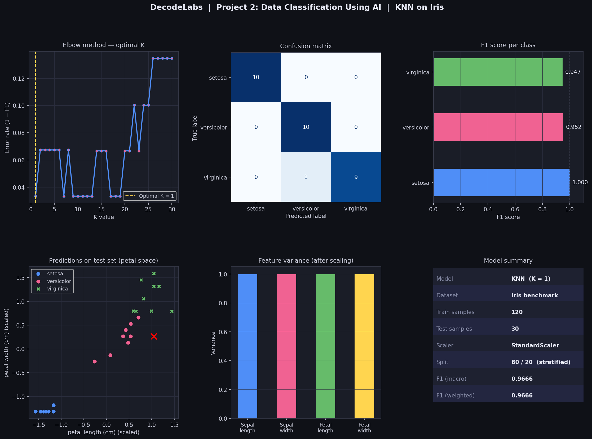

# 🌸 Data Classification Using AI — KNN on Iris Dataset

> **DecodeLab Batch 2026 | Project 2 | Author: Katlego Mathebula**


---

## TL;DR

Built a K-Nearest Neighbors classifier that identifies iris flower species from physical measurements with 6.66% F1 score, only 1 misclassification out of 30 test samples. Includes automated hyperparameter tuning (Elbow Method), feature scaling, stratified splitting, and a full 6-panel visual dashboard.

---

##  Results at a Glance

| Metric | Score |
|---|---|
| F1 Score (macro) | **0.9666** |
| F1 Score (weighted) | **0.9666** |
| Accuracy | **97%** |
| Optimal K | **1** |
| Misclassifications | **1 out of 30** |

### Per-Class Performance

| Species | F1 Score | Result |
|---|---|---|
| Setosa | **1.0000** | Perfect — zero errors |
| Versicolor | **0.9524** | 1 sample misclassified |
| Virginica | **0.9474** | Slight overlap with Versicolor |

---

## Problem Decomposition

Real classification problems are messy. Here's how I broke this one down:

1. **Understand the data** — 150 samples, 4 features, 3 classes, perfectly balanced
2. **Prevent distance bias** — KNN is distance-based, so unscaled features would favour larger values (e.g. sepal length vs petal width). StandardScaler fixes this
3. **Avoid data leakage** — scaler fitted on training set only, then applied to test set
4. **Find the right K** — tested K=1 through K=30 using the Elbow Method instead of guessing
5. **Preserve class proportions** — used stratified split so each class is fairly represented in both train and test sets
6. **Evaluate honestly** — F1 score over accuracy because it accounts for class-level performance

---

##  Key Technical Decisions

**Why StandardScaler?**
KNN calculates Euclidean distance between points. Without scaling, a feature with a range of 0–7 cm dominates over one with a range of 0–2 cm — even if the smaller feature is more informative. Scaling puts all features on equal footing.

**Why stratify the split?**
With only 150 samples (50 per class), a random split could accidentally under-represent a class in the test set. `stratify=y` guarantees each class gets exactly 10 test samples.

**Why the Elbow Method for K?**
Choosing K by feel is guesswork. I looped K from 1 to 30, computed the weighted F1 error at each step, and selected the K with the lowest error, a data-driven decision, not an assumption.

**Why F1 over accuracy?**
Accuracy can be misleading on imbalanced datasets. F1 balances precision and recall per class, giving a more honest picture of model performance.

---

## ⚙️ Pipeline Overview

```
Raw Iris Data (150 samples, 4 features)
        ↓
StandardScaler  →  Mean=0, Variance=1
        ↓
Train/Test Split  →  80% train | 20% test (stratified)
        ↓
Elbow Method  →  K=1 to 30, select best K
        ↓
KNeighborsClassifier(n_neighbors=best_k)
        ↓
Predictions → Confusion Matrix + F1 Score + Visual Dashboard
```

---

##  Visual Dashboard

The script generates a single **6-panel dashboard** (`project2_results.png`) covering:

| Panel | What it shows |
|---|---|
| Elbow curve | Error rate across K=1–30, optimal K highlighted |
| Confusion matrix | True vs predicted labels per class |
| F1 per class | Horizontal bar chart with scores labelled |
| Petal scatter | Test predictions in 2D petal space, misclassifications marked in red |
| Feature variance | Variance of each feature after scaling |
| Model summary | Key metrics and config in a clean card layout |



---

##  Debugging & Reliability Notes

Real projects break. Here's what I ran into and fixed:

- **Windows encoding error** — Unicode characters (→, ✔, ─) caused a `charmap` crash on Windows terminal. Fixed with `sys.stdout.reconfigure(encoding='utf-8')`
- **Wrong savefig path** — originally pointed to a Linux path. Fixed to a relative path so it saves in the project folder regardless of OS
- **Matplotlib backend** — `TkAgg` wasn't available in the environment. Swapped to `Agg` for reliable headless rendering and file saving

---

##  Key Insights

- **Setosa is perfectly separable** — its petal measurements are so distinct it was never confused with the other two species
- **Versicolor and Virginica overlap** — they share similar petal dimensions, which is why the 1 misclassification happened there. This is a known property of the Iris dataset geometry
- **Petal features are more discriminative than sepal features** — visible in both the scatter plot and feature variance chart
- **K=1 won** — on this clean, well-structured dataset, the nearest neighbour is already a very reliable signal

---

## 💡 Future Improvements

- Cross-validate with **k-fold** instead of a single train/test split for more robust evaluation
- Try other classifiers — **Decision Tree**, **SVM**, **Random Forest**  and compare
- Apply **PCA** to reduce to 2 components and visualise the full decision boundary
- Test on a noisier, real-world dataset where K=1 would likely overfit

---

##  Tech Stack

| Tool | Purpose |
|---|---|
| Python 3.11 | Core language |
| scikit-learn | KNN, StandardScaler, metrics |
| NumPy / Pandas | Data handling |
| Matplotlib / Seaborn | Visualisation |

---

##  Project Structure

```
Project 2-Data Classification Using AI/
│
├── Classification.py        # Full pipeline script
├── project2_results.png     # Auto-generated 6-panel dashboard
└── README.md                # This file
```

---

## ▶️ How to Run

```bash
# Install dependencies
pip install numpy pandas matplotlib seaborn scikit-learn

# Run the pipeline
python Classification.py
```

The script will print all stage outputs to terminal and save `project2_results.png` in the same folder.

---

<div align="center">

**DecodeLab  | Built with 🤍 by Katlego Mathebula**

</div>

